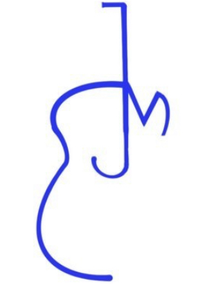

*Code Institute / Milestone Project 1: User-Centric Front-End Development*

# WELCOME TO EWAN JAMES MUSIC!

### This is the one and only official site for all things related to Ewan James' music.

Ewan is my son and an aspiring musician who writes, produces and plays his own original songs. Although present on some social media sites, he wanted
 me to design him a website to channel all these mediums in one place and begin building up his name and brand.
 
From his website, a visitor can signup
for exclusive email updates, find the latest gig locations and dates, buy tickets, download the latest music by Ewan James, see pictures from his
musical journey or watch his latest youtube videos.
 
The milestone project required me to design and build a website with at least three pages or
page sections for a real or ficticious band. In this case I decided that since Ewan needed a website designed to help promote his songs that this is
what I would do for the project and he agreed.

## UX

**STRATEGY & SCOPE:**

After discussions with Ewan on what he wanted to achieve by having a website plus what he expected a visitor to the site to find and how they would
interact with the site, he decided on the following:

**Goals set by the website owner:**

1. Build brand awareness of EJM logo to represent his music.
2. Consolidation of social media presence.
3. Build a database of fans to directly contact via email subscriptions.
4. Use the website to advertise and distribute his own music.
5. Sell official merchandise and tickets.

**Goals set for the user:**

1. Download new music by Ewan James.
2. Receive email newsletters about Ewan James.
3. Find out more about Ewan James and his equipment.
4. Watch videos by Ewan James.
5. Buy official merchandise and tickets.

Since Ewan is a teenager himself and writes songs about the highs and lows of being a teenager, he wanted to target the age ranges **from 15 to 25** as his
potential audience. Therefore, the social media links should be prominent on every page of the site as this is how he believes his target audience
predominantly communicate.

## FEATURES:

Nine main things were identified as the features that Ewan wanted on his website. These were:

1. EJM brand logo on every page.
2. Links to all his social media pages.
3. 'Signup' page for email contact database.
4. 'Download' page for songs.
5. 'Shop' page for selling merchandise.
6. 'Webchat' facility to communicate with fans via the website.
7. 'About Me' biography with his life-story (so far).
8. 'Book Me' link for booking gigs.
9. 'Buy Tickets' link for selling tickets to fans.

These features were simplfied and categorised for importance and viability/feasability on a scale of 1-5 as per the lesson on 'UX Strategy Tradeoffs'.
The results were as follows:

Features              | Importance | Viability/Feasability
----------------------|------------|----------------------
1. Social Media Links | 5          | 5
2. Email Signup       | 5          | 3
3. Audio Downloads    | 5          | 5
4. Merchandise Sales  | 3          | 1
5. Webchat            | 2          | 2
6. 'Book Me' facility | 4          | 3
7. Video links        | 5          | 5
**TOTALS**            | **29**     | **24**

The results showed that the features of highest importance, viability and feasibility were items 1, 2, 3 and 7 so these should all be included in the
site. Item 6 would be added if time and resources allowed.

**Features left to implement:**
Item 5 was not important enough or able to be achieved within the timeframe set to complete the project. Item 4 was mildly important with a score of 3,
but since there is currently no merchandise available and I don't have the skills/resources to setup an online shop then this was considered as a
future improvement to the site.

## TECHNOLOGIES USED:

* HTML5 - This was used to create the 'shell' or main structure of each webpage.
* CSS3 - Cascading Stylesheets to create the look of the site such as colours, typography and image display.
* Bootstrap V4.6 - Styling plugins to speed up the process of coding and add 'straight-out-of-the-box' code for specific features of the webpages.
* Font Awesome V5.15.2 - This link is for adding icons to the webpages.

## TESTING:

I created 2 spreadhsheets to maintain continuous testing throughout the course of creating this project. The first is a spreadsheet I created for 
logging small commit-level tests after each code or feature change. The second was a more detailed spreadsheet designed to test the validity of the code on each 
page and also the responsiveness on multiple different viewing platforms and web browsers. This was similar to a testing process created by former 
student of the Code Institute, Tim Nelson and I re-created and adapted it to work with the contents of my website and testing so as not to copy his work directly.

## DEPLOYMENT:

## CREDITS:
* Photos were supplied by Ewan Brown (Ewan James) along with the audio and social media links.
* Biography of Ewan was written by him and then modified by me to suit the needs of each page in the website.

## CONTENT:

## MEDIA:

## ACKNOWLEDGEMENTS:

* Thankyou to fellow SLACK user Michael Dijk for the suggestion on using www.responsinator.com to test the responsiveness of the site and help decide what viewing formats to virtually test the site on.

